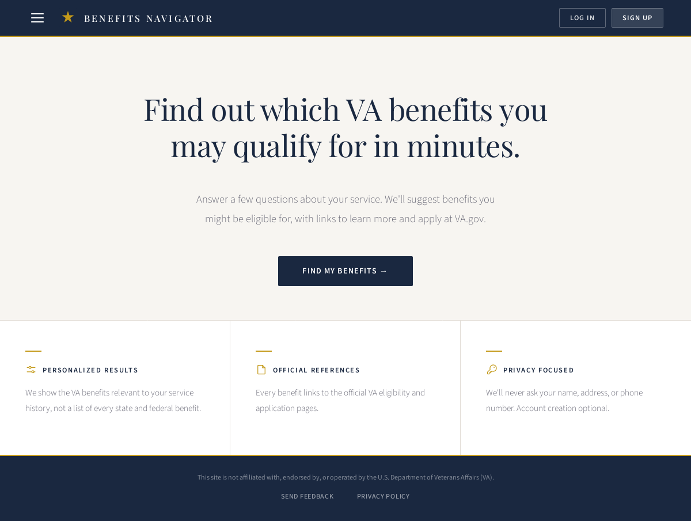
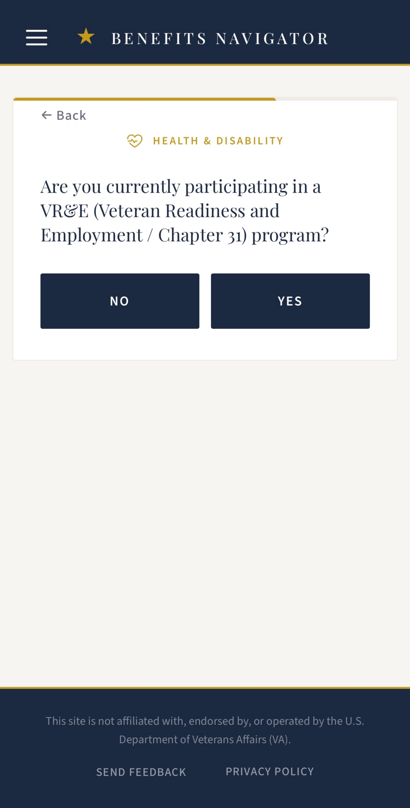
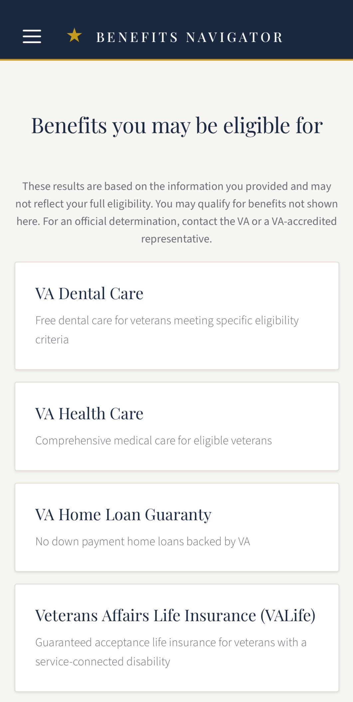

# Veteran Benefits Navigator

A guided web app that helps U.S. veterans figure out which VA benefits they qualify for and how to actually claim them.

**Live site: [vabenefits.app](https://vabenefits.app)**

## Screenshots

<p align="center">
  
</p>

<table>
  <tr>
    <td align="center" width="50%">
      
      <br/>
      <sub>Questionnaire (mobile)</sub>
    </td>
    <td align="center" width="50%">
      
      <br/>
      <sub>Results (mobile)</sub>
    </td>
  </tr>
</table>

## Why I built this

I'm a U.S. Air Force veteran. Following my seperation, I struggled to get connected with VA benefits. I wanted to create an easy-to-use tool that would help veterans in a similar situation. The landscape is complex and challenging to navigate. This website should serve as a low barrier entry point for veterans who don't know where to begin.

## What it does

- A branching, single-page questionnaire collects a service profile: service periods (entry/separation dates, active-duty status, officer/enlisted, discharge level), disability rating, service-connected conditions, financial means, and a few decoration/program flags.
- Submitting the questionnaire runs the answers through a deterministic eligibility engine and returns the set of matched benefits.
- Each matched benefit is presented with a short summary, a plain-English eligibility rationale, and a link to its application page on VA.gov.
- Anonymous users can complete the flow end-to-end without an account; results are persisted in `localStorage`. Optional accounts persist results server-side.
- Mobile-first design with full keyboard navigation and `prefers-reduced-motion` support throughout.

## Tech stack

**Frontend**
- React 19 + TypeScript
- Vite (dev server + build)
- React Router 7
- CSS modules-style hand-written CSS (no CSS-in-JS, no Tailwind)
- Self-hosted fonts via `@fontsource` (Playfair Display, Source Sans 3)
- Phosphor Icons (inlined as SVG)

**Backend**
- Node.js + Express 5 + TypeScript
- PostgreSQL via `pg`
- Sessions stored in Postgres via `connect-pg-simple`
- `zod` for request schema validation (shared types between client and server)
- `bcrypt` for password hashing
- `helmet` + `express-rate-limit` for HTTP hardening
- `pino` + `pino-http` for structured logging
- `resend` for transactional email
- `node-pg-migrate` for schema migrations

**Infrastructure**
- DigitalOcean VPS (Ubuntu)
- Nginx reverse proxy, HSTS terminated at the edge
- Self-hosted PostgreSQL on the same droplet
- GitHub Codespaces for development

## Architecture

The repo is a monorepo with a `client/` (Vite + React) and a `server/` (Express + Postgres). The two communicate over a small JSON API — the client posts the completed questionnaire to `POST /api/questionnaire`, the server validates the body against a Zod schema, runs it through the eligibility engine, and returns the matched benefits.

The questionnaire itself lives in `client/src/Questionnaire.tsx` and is a single-component branching wizard with `localStorage`-backed step/answer/history persistence. Its branching logic, conditional follow-ups, and three-section structure are documented in `docs/questionnaire-spec.md`, which is the source of truth a future maintainer (or replacement client) should be able to redesign against.

The eligibility engine is a set of pure, deterministic functions in `server/src/eligibility.ts`. Each VA benefit has its own check function that consumes a typed `QuestionnaireAnswers` object and returns a boolean (with rationale strings in the seeded benefit data). Adding a new benefit means seeding a row and writing one check. There is no rules engine, no DSL — just typed TypeScript predicates.

Benefit content (names, summaries, application URLs, eligibility rationales) is seeded from `server/src/seed.ts` rather than entered through an admin UI; the catalogue is small enough and changes infrequently enough that a code-reviewed seed file is a better source of truth than a CMS.

## Local development

Prerequisites: Node 20+, a local PostgreSQL 14+ instance, and `npm`.

```bash
# 1. Clone
git clone https://github.com/<your-fork>/veteran-benefits-navigator.git
cd veteran-benefits-navigator

# 2. Install dependencies (client and server are independent npm projects)
cd client && npm install && cd ..
cd server && npm install && cd ..
```

Create a database and configure environment variables:

```bash
# 3. Create a local database
createdb vbn_dev

# 4. Create server/.env with the following keys
#    (no .env.example is checked in — these are the variables the server reads)
```

Required environment variables for the server (`server/.env`):

| Variable | Purpose |
|---|---|
| `DATABASE_URL` | e.g. `postgres://localhost:5432/vbn_dev` |
| `SESSION_SECRET` | Random string, **min 32 characters** (server refuses to start otherwise) |
| `APP_ORIGIN` | e.g. `http://localhost:5173` (at least one of `APP_ORIGIN` or `STAGING_ORIGIN` is required) |
| `STAGING_ORIGIN` | Optional second allowed origin |
| `APP_URL` | Public base URL used in emails |
| `ADMIN_PASSWORD` | Basic-auth password for `/admin` routes |
| `RESEND_API_KEY` | Resend API key for transactional email (optional in dev) |
| `EMAIL_FROM` | From-address for transactional email |
| `LOG_LEVEL` | `debug` / `info` / `silent` etc.; defaults to pino's default |
| `NODE_ENV` | `development` locally; gates secure-cookie behavior in `production` |
| `PORT` | Defaults to `3000` |

Run migrations and seed the benefit catalogue:

```bash
# 5. Apply schema migrations
cd server && npm run migrate:up

# 6. Seed the benefit data
npm run seed
```

Run the two dev servers in separate terminals:

```bash
# Terminal 1 — backend on :3000
cd server && npm run dev

# Terminal 2 — frontend on :5173
cd client && npm run dev
```

Visit `http://localhost:5173`. The Vite dev server proxies `/api/*` to the backend.

Server tests:

```bash
cd server && npm test
```

## Key technical decisions

**Self-hosted Postgres on a single VPS rather than a managed service.** I deliberately avoided Supabase, Neon, RDS, and similar abstractions for this project. I wanted to learn the operational side end-to-end — provisioning the box, configuring `pg_hba.conf`, running migrations, setting up backups, terminating TLS at Nginx. Tradeoff: I own the maintenance and the on-call. For a real production veteran-facing service this would be the wrong call; for a portfolio project where the operational learning is part of the point, it's the right one.

**TypeScript across the full stack with shared schemas via Zod.** `server/src/schemas.ts` defines the questionnaire and answer shapes once, and the client imports the inferred types. The server validates incoming requests against the same Zod schema at runtime. This collapses an entire class of contract bugs (frontend sending a field the backend doesn't recognize, or vice versa) into compile-time errors.

**Deterministic eligibility logic as plain functions, not a rules engine.** Each benefit has a `check<BenefitName>(answers)` function in `server/src/eligibility.ts`. No DSL, no JSON config, no expression evaluator. Tradeoff: rule changes require a deploy. Upside: the rules are typed, testable as pure functions, reviewable in a normal PR diff, and a new contributor can read them top-to-bottom in an afternoon. Each check has a corresponding test file under `server/tests/`.

**Anonymous-first user model.** A veteran can land on the site, complete the questionnaire, and see results without ever creating an account. Account creation is offered but never required, and email is opt-in even at registration (with a clear note that account recovery requires it). The questionnaire's progress is persisted to `localStorage`, not to the server, until the user explicitly submits. This is partly a privacy posture for a veteran-facing app and partly a conversion decision — making people sign up before they've seen any value is the surest way to lose them.

**Branching questionnaire with `localStorage` step + history persistence and animated transitions.** The questionnaire is one big component (`client/src/Questionnaire.tsx`, ~1.7k lines). I tried earlier to break it into per-step subcomponents and the indirection made the branching logic harder to reason about, not easier — the logic *is* the value, and a single switch on `currentStep` keeps it readable. Step, answers, and a LIFO snapshot history are mirrored to `localStorage` on every change so an accidental refresh doesn't wipe ten minutes of progress. Transitions between questions and section headers use coordinated CSS animations gated on `prefers-reduced-motion`.

## Roadmap

- **VA Lighthouse API integration** — pull live appointment, claim status, and benefit data via the Patient Health FHIR API for veterans who choose to authenticate, rather than relying entirely on self-reported answers.
- **Guided claim flow per benefit** — extend each matched benefit beyond a link to VA.gov into a step-by-step tracker so a veteran can see exactly what's left in their application and pick up where they left off.
- **Service-connected dental refinement** — the questionnaire asks a single generic service-connected-condition question, but VA Dental specifically requires a *dental* service connection. See `docs/tech-debt.md`.
- **Open-source / nonprofit handoff** — long term, this is more useful to veterans as a community-maintained resource than as a personal project.

## Acknowledgments

- [Phosphor Icons](https://phosphoricons.com/) by Helena Zhang and Tobias Fried (MIT). Section-header icons in the questionnaire are inlined directly from the Phosphor Regular weight.
- [@fontsource](https://fontsource.org/) for self-hosted font packaging of Playfair Display and Source Sans 3.

This project is not affiliated with, endorsed by, or otherwise connected to the U.S. Department of Veterans Affairs. All benefit information is drawn from publicly available VA sources and links to official VA.gov pages for the actual application process.

## License

No `LICENSE` file is checked in yet. For a portfolio project, MIT is a reasonable default; that decision is intentionally being kept separate from this commit.
